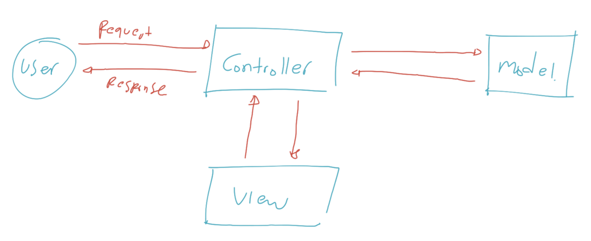
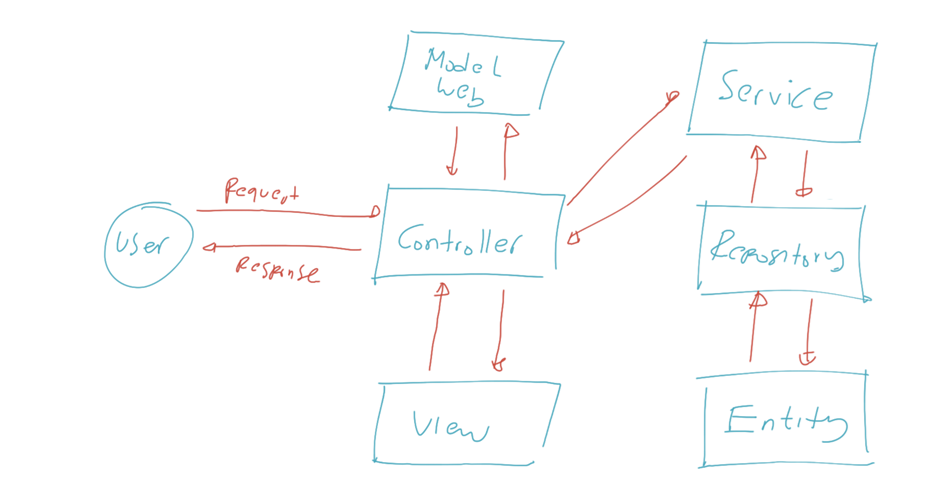
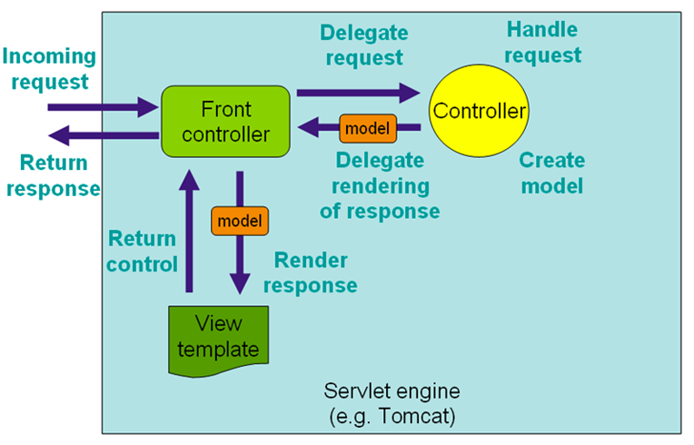

# MVC

- Model, merupakan bagian yang merepresentasikan data. Seperti yang kita ketahui, ada banyak sekali jenis data, seperti data request, data response, data table, dan lain-lain, sehingga kadang kita perlu memperkecil lagi scope dari Model itu sendiri ketika membuat aplikasi.
- View, merupakan bagian yang merepresentasikan tampilan, seperti halaman web, desktop, mobile, dan lain-lain.
- Controller, merupakan bagian yang mengurus alur kerja dari menerima input, memanipulasi data Model, sampai menampilkan View. Anggap saja Controller merupakan core logic dari aplikasi.
#
### Diagram MVC

Walaupun sekilas MVC sangat sederhana, pada kenyataannya ketika kita membuat aplikasi yang kompleks, kita biasanya tidak lagi bisa memanfaatkan MVC.
Kadang kita butuh mengimplementasikan design pattern lain, seperti misal nya Service Pattern, Repository Pattern, dan lain-lain.
#
### Diagram Aplikasi Kompleks

#
### Cara Kerja Spring Web MVC
