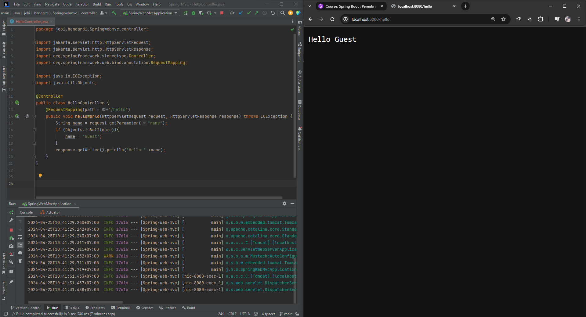

# Request Mapping

Di Spring WebMVC, untuk menambahkan Routing, kita bisa menggunakan annotation RequestMapping pada method yang ingin kita jadikan sebagai Controller Handler nya. RequestMapping adalah sebuah anotasi dalam Spring MVC yang digunakan untuk memetakan permintaan HTTP ke Method-Method dalam kontroler. Anotasi ini dapat digunakan di level class maupun di level method.

**Contoh :** 
```sh
@Controller
public class HelloController {
    @RequestMapping(path = "/hello")
    public void helloWorld(HttpServletRequest request, HttpServletResponse response) throws IOException {
        String name = request.getParameter("name");
        if (Objects.isNull(name)){
            name = "Guest";
        }
        response.getWriter().println("Hello " +name);
    }
}
```

Kode diatas menggunakan anotasi @Controller dan @RequestMapping untuk menangani permintaan HTTP.

Method helloWorld() mengambil objek HttpServletRequest dan HttpServletResponse sebagai parameter. Ini adalah objek yang digunakan untuk menerima permintaan HTTP dari klien dan mengirimkan respons kembali ke klien.

Di dalam Method tersebut, program mengambil parameter "name" dari permintaan menggunakan request.getParameter("name"). Jika parameter "name" tidak ada dalam permintaan, program menganggap bahwa user adalah "Guest".

Kemudian, program mengirimkan respons kembali ke klien menggunakan response.getWriter().println("Hello " + name), yang akan menampilkan pesan "Hello" bersama dengan nama user (atau "Guest" jika tidak ada nama yang diberikan) ke dalam halaman HTML.
#
### Hasil Test

