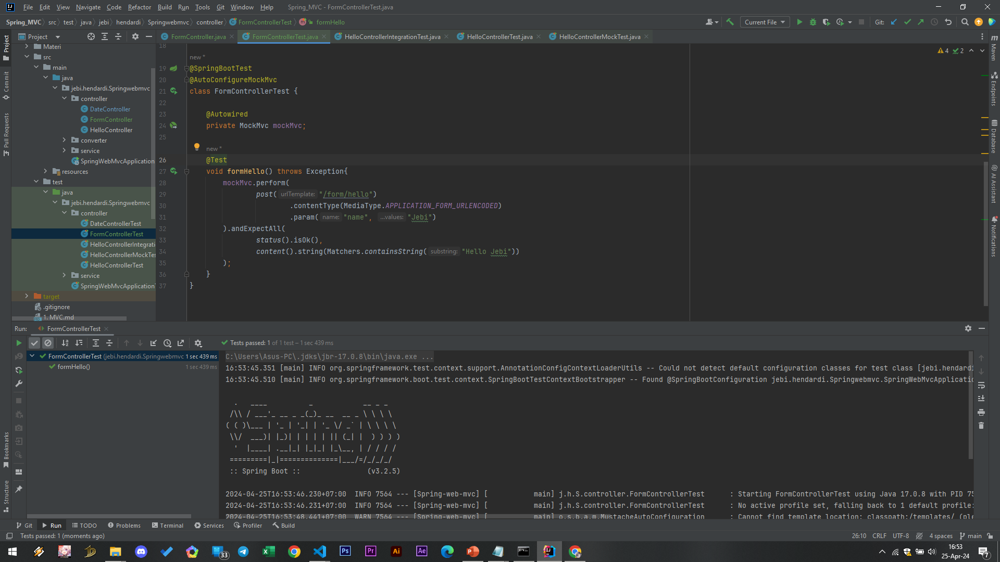

# Request Content Type

- Saat kita membuat Controller Method, kita juga bisa membatasi jenis Content-Type yang dikirim oleh user
- Contoh pada kasus melakukan submit data form, kita biasanya meminta Content-Type yang dikirim oleh user adalah application/x-www-form-urlencoded
- Untuk membatasi tipe Content-Type, kita bisa tambahkan di @RequestMapping pada attribute consume. Contoh dibawah merupakah request content type APPLICATION_FORM_URLENCODED_VALUE

### FormController
```sh
@Controller
public class FormController {

    private SimpleDateFormat dateFormat = new SimpleDateFormat("yyyy-MM-dd");
    @PostMapping(path = "/form/hello", consumes = MediaType.APPLICATION_FORM_URLENCODED_VALUE)
    @ResponseBody
    public String hello(@RequestParam(name = "name") String name) {
        return "Hello " + name;
    }
}
```

### Unit Test FormController
