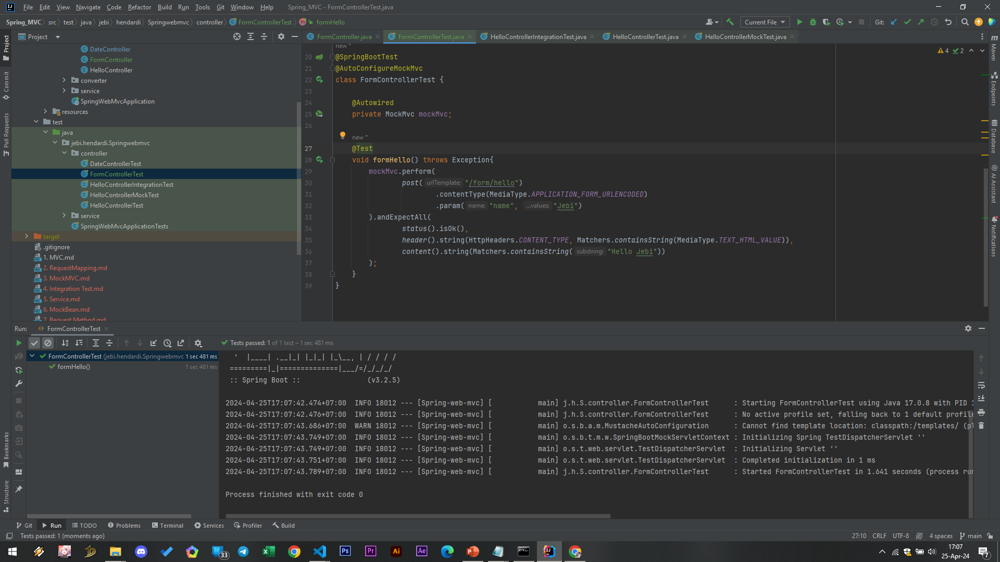

# Response Content Type

Di @RequestMapping, selain consume, terdapat juga attribute produce, yang bisa kita gunakan untuk memberi tahu di HTTP Response, Content-Type dari response body yang dikembalikan

### FormController, menambahkan Produces Text_HTML_Value
```sh
@Controller
public class FormController {

    private SimpleDateFormat dateFormat = new SimpleDateFormat("yyyy-MM-dd");
    @PostMapping(path = "/form/hello", consumes = MediaType.APPLICATION_FORM_URLENCODED_VALUE, produces = MediaType.TEXT_HTML_VALUE
    )
    @ResponseBody
    public String hello(@RequestParam(name = "name") String name) {
        return """
                <html>
                <body>
                <h1>Hello $name</h1>
                </body>
                </html>
                """.replace("$name", name);
    }
}
```

### Unit Test FormController


