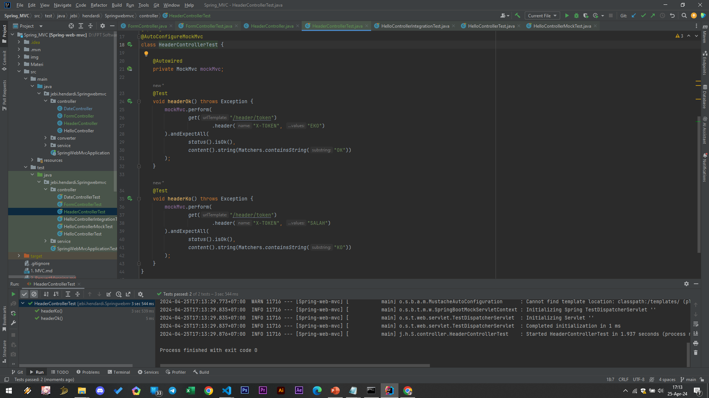

# Request Header

- Spring WebMVC memiliki cara lebih mudah dengan menggunakan annotation @RequestHeader
- Caranya kita bisa tambahkan di parameter di Controller Method
- Kita juga bisa menentukan apakah wajib atau tidak, dan juga default value nya, fitur Converter juga bisa digunakan untuk Request Header
#
### HeaderController
```sh
@Controller
public class HeaderController {

    @GetMapping(path = "/header/token")
    @ResponseBody
    public String header(@RequestHeader(name = "X-TOKEN") String token) {
        if ("EKO".equals(token)) {
            return "OK";
        } else {
            return "KO";
        }
    }
}
```
#
### Unit Test HeaderController


