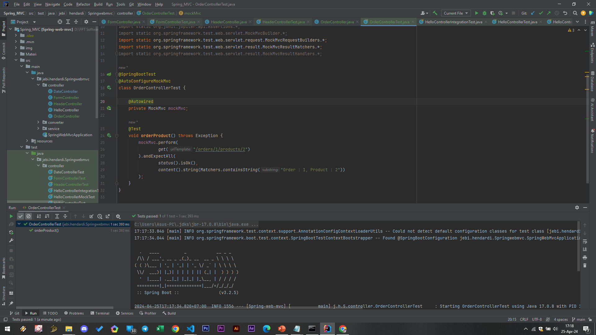

# Path Variable
- Path Variable adalah fitur dimana kita bisa membuat patterns pada URL Path, dan mengambil nilai yang terdapat di URL Path nya
- Dengan fitur ini, kita bisa membuat URL Path yang dinamis, dan bisa mendapatkan nilai dinamis di URL Path nya secara otomatis
- Untuk menggunakan fitur ini, kita perlu tambahkan variable path nya di URL Path nya, dan juga menambahkan parameter dengan annotation @PathVariable
- Path Variable juga memiliki kemampuan otomatis konversi tipe data dengan Converter

### OrderController
```sh
@Controller
public class OrderController {

    @GetMapping(path = "/orders/{orderId}/products/{productId}")
    @ResponseBody
    public String order(@PathVariable("orderId") String orderId, @PathVariable("productId") String productId) {
        return "Order : " + orderId + ", Product : " + productId;
    }
}
```

### Unit Test OrderController

