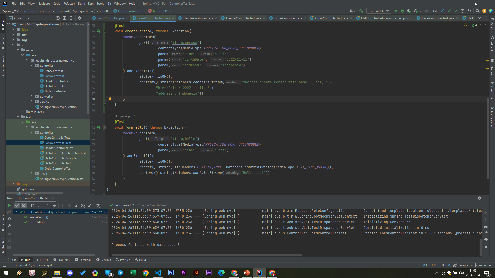

# Form Request
- Untuk mendapatkan data di Form Request, kita bisa menggunakan annotation @RequestParam
- Secara otomatis Spring Web MVC juga akan mengambil data dari Form Request atau Query Parameter
#
### Form Controller
```sh
@Controller
public class FormController {

    private SimpleDateFormat dateFormat = new SimpleDateFormat("yyyy-MM-dd");

    @PostMapping(path = "/form/person", consumes = MediaType.APPLICATION_FORM_URLENCODED_VALUE)
    @ResponseBody
    public String createPerson(
            @RequestParam(name = "name") String name,
            @RequestParam(name = "birthDate") Date birthDate,
            @RequestParam(name = "address") String address
    ) {
        return "Success create Person with name : " + name +
                ", birthDate : " + dateFormat.format(birthDate) +
                ", address : " + address;
    }

    @PostMapping(
            path = "/form/hello",
            consumes = MediaType.APPLICATION_FORM_URLENCODED_VALUE,
            produces = MediaType.TEXT_HTML_VALUE
    )
    @ResponseBody
    public String hello(@RequestParam(name = "name") String name) {
        return """
                <html>
                <body>
                <h1>Hello $name</h1>
                </body>
                </html>
                """.replace("$name", name);
    }
}
```

#
### Unit Test Form Controller


