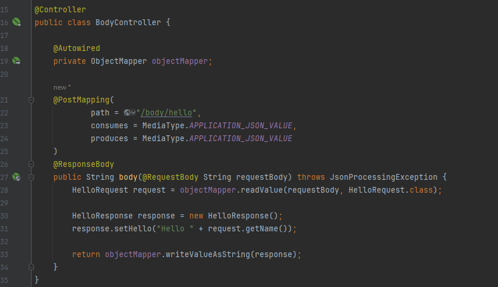
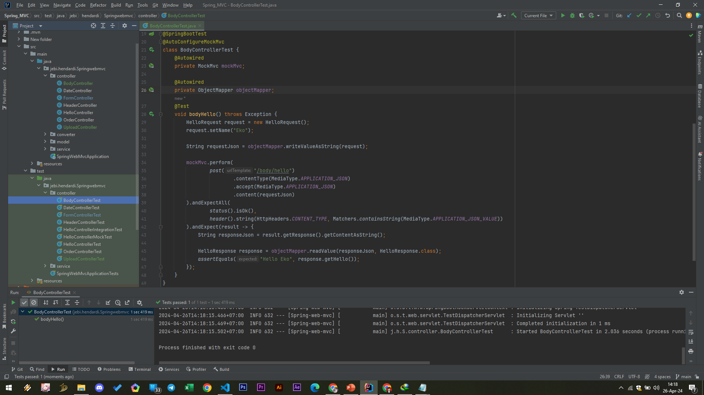

# Request Body
- Saat membuat aplikasi web berupa RESTful API, kadang kita ingin mengirim data lewat Request Body dalam bentuk format data seperti JSON, XML, dan sejenisnya
- Spring bisa digunakan untuk membaca data Request Body secara mudah, cukup menggunakan annotation @RequestBody
- https://docs.spring.io/spring-framework/docs/current/javadoc-api/org/springframework/web/bind/annotation/RequestBody.html 

### Hello Request
```sh
public class HelloRequest {
    private String name;
}
```

#
### Hello Response
```sh
public class HelloResponse {
    private String hello;
}
```

#
### API BodyController


#
### Unit Test BodyController

