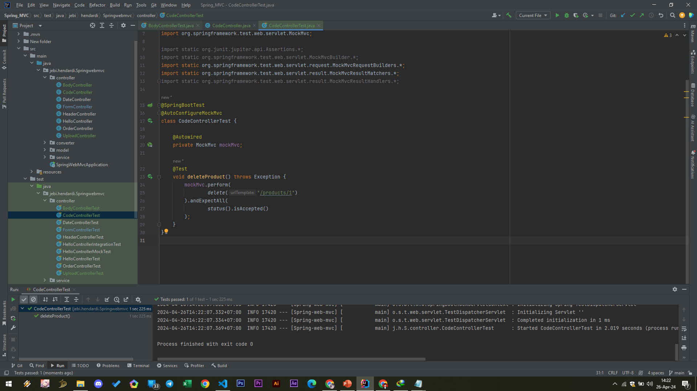

# Response Status

- Saat kita membuat HTTP Response, kadang kita ingin mengubah Response Status Code
- Secara default, response sukses adalah 200, kadang mungkin kita ingin ubah secara manual
- Jika kita ingin ubah secara dinamis, kita bisa gunakan HttpServletResponse
- Atau jika kita ingin hardcode response status nya, kita bisa gunakan annotation @ResponseStatus di Controller Method nya
- https://docs.spring.io/spring-framework/docs/current/javadoc-api/org/springframework/web/bind/annotation/ResponseStatus.html 


### Code Controller
```sh
@Controller
public class CodeController {

    @DeleteMapping(path = "/products/{id}")
    @ResponseBody
    @ResponseStatus(HttpStatus.ACCEPTED)
    public void delete(@PathVariable("id") Integer id){
    }
}
```

#
### Unit Test CodeController
