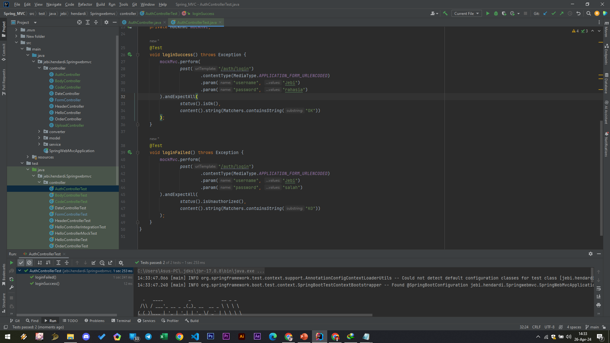

# Response Entity

- Spring menyediakan cara yang sangat flexible untuk membuat HTTP Response menggunakan object ResponseEntity
- Kita bisa return di Controller Method dengan object ResponseEntity
- https://docs.spring.io/spring-framework/docs/current/javadoc-api/org/springframework/http/ResponseEntity.html 

### Auth Controller

#
### Unit test AuthController
