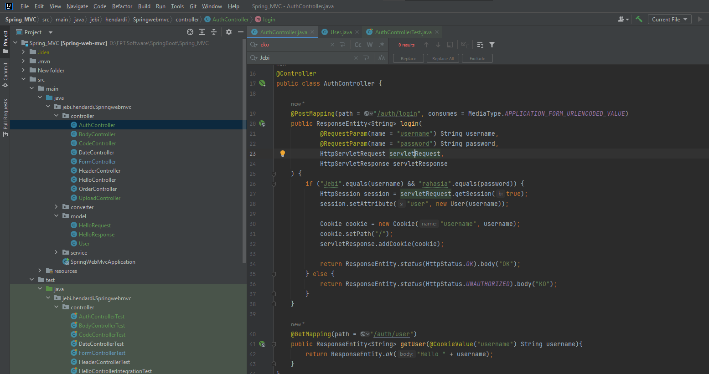
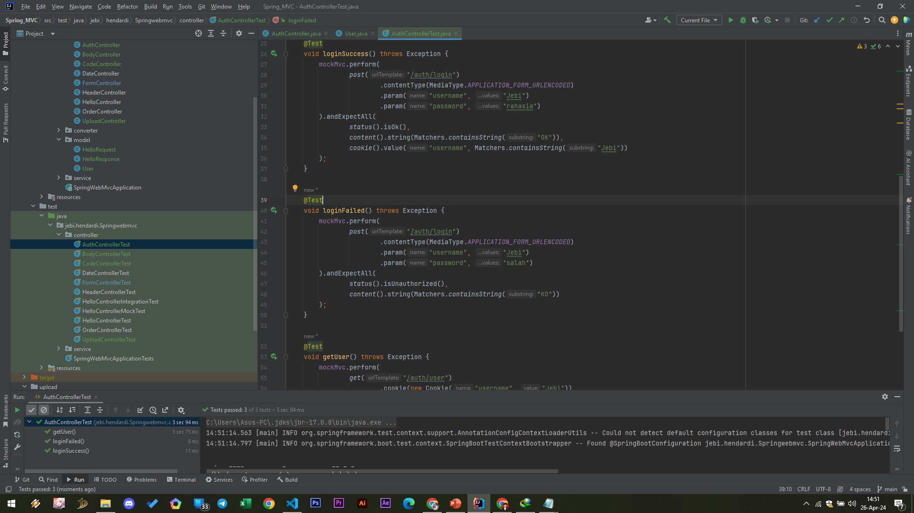

# Cookie
- Cara membuat Cookie di Spring Web MVC bisa dilakukan dengan menggunakan HttpServletResponse seperti pada Java Servlet
- Namun untuk membaca Cookie yang dikirim oleh Web Browser, kita bisa otomatis menggunakan annotation @CookieValue
- https://docs.spring.io/spring-framework/docs/current/javadoc-api/org/springframework/web/bind/annotation/CookieValue.html 

#
### AuthController Login

#
### Unit Test AuthController Cookie
