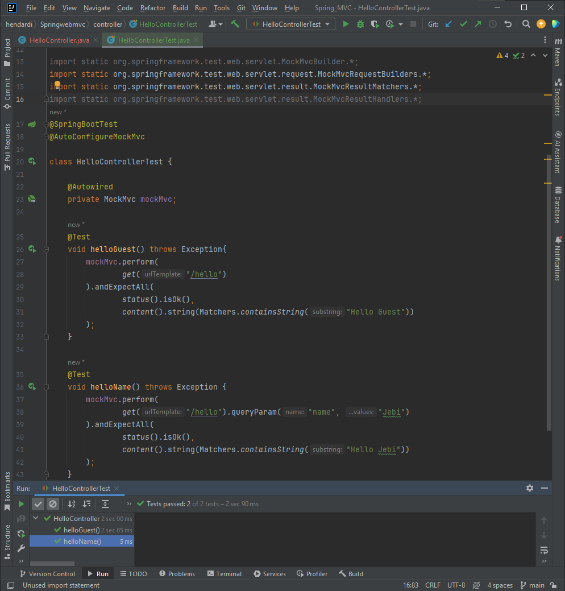

# Mock MVC

Fitur ini digunakan untuk mempermudah melakukan unit test. Dengan menggunakan MockMVC, kita bisa melakukan test semua Controller yang kita buat, tanpa harus menjalankan aplikasi Web nya, dan tidak perlu melakukan pengetesan secara manual menggunakan Browser atau HTTP Client.

**Static Imports Mock MVC**
```
import static org.springframework.test.web.servlet.MockMvcBuilder.*;

import static org.springframework.test.web.servlet.request.MockMvcRequestBuilders.*;

import static org.springframework.test.web.servlet.result.MockMvcResultMatchers.*;

import static org.springframework.test.web.servlet.result.MockMvcResultHandlers.*;
```

**Contoh : Unit Test Hello Route**
```sh
@SpringBootTest
@AutoConfigureMockMvc

class HelloControllerTest {

    @Autowired
    private MockMvc mockMvc;

    @Test
    void helloGuest() throws Exception{
        mockMvc.perform(
                get("/hello")
        ).andExpectAll(
                status().isOk(),
                content().string(Matchers.containsString("Hello Guest"))
        );
    }

    @Test
    void helloName() throws Exception {
        mockMvc.perform(
                get("/hello").queryParam("name", "Jebi")
        ).andExpectAll(
                status().isOk(),
                content().string(Matchers.containsString("Hello Jebi"))
        );
    }
}
```

**Method helloGuest()** Melakukan permintaan GET ke endpoint "/hello" tanpa menyertakan parameter nama. Sedangkan **Method helloName()**
Melakukan permintaan GET ke endpoint "/hello" dengan menyertakan parameter nama "Jebi". Sama seperti sebelumnya, menggunakan perform() untuk melakukan permintaan dan andExpectAll() untuk mendapatkan respons status OK (200) dan mengandung string "Hello Jebi".
#
### Hasil Test
