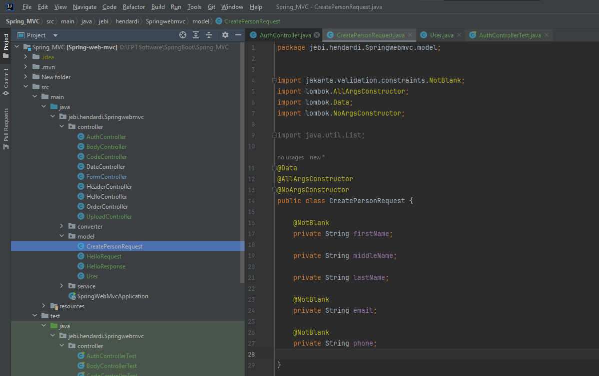
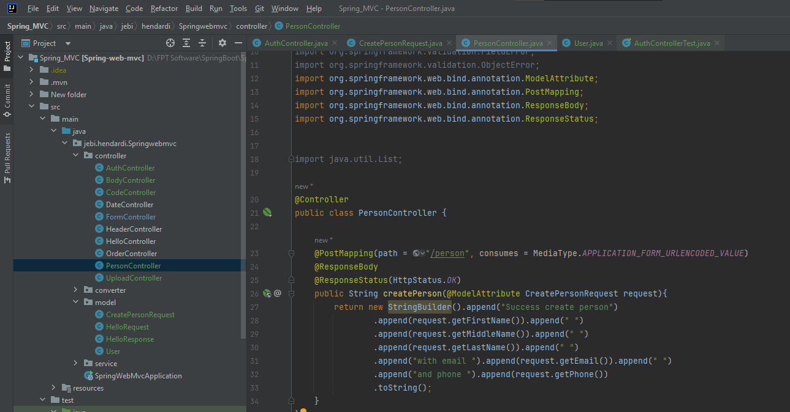
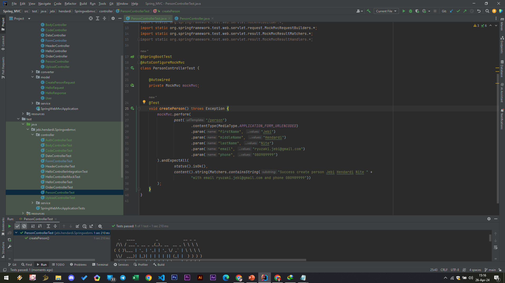

# Model Attribute

- Saat kita mengirim request berupa form dengan input yang banyak, kadang menyulitkan kita jika kita harus membuat semua parameter input dengan @RequestParam
- Bayangkan jika ada 10 input, maka kita harus membuat 10 parameter @RequestParam
- Spring memiliki fitur dimana kita bisa melakukan binding attribute yang dikirim dengan class Java Bean yang kita buat menggunakan annotation @ModelAttribute
- https://docs.spring.io/spring-framework/docs/current/javadoc-api/org/springframework/web/bind/annotation/ModelAttribute.html 

#
### Model CreatePersonRequest

#
### Person Controller

#
### Unit Test Person Controller

