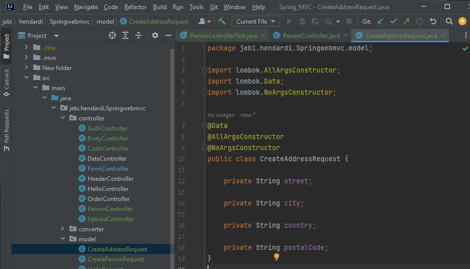
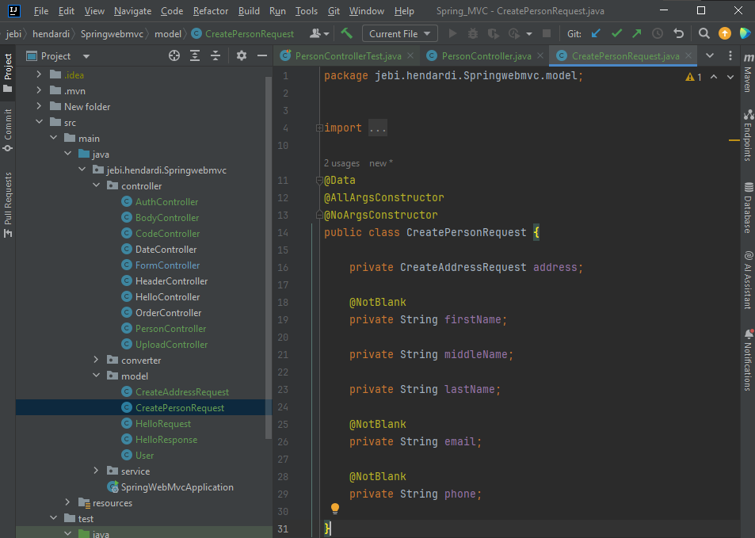
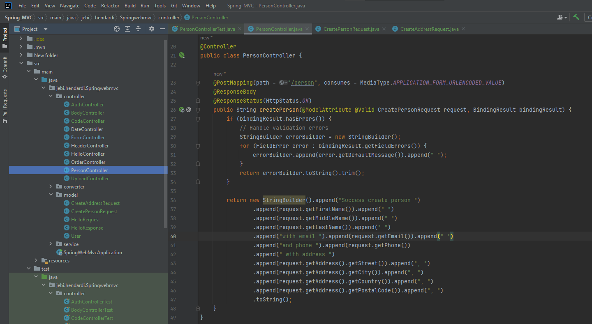
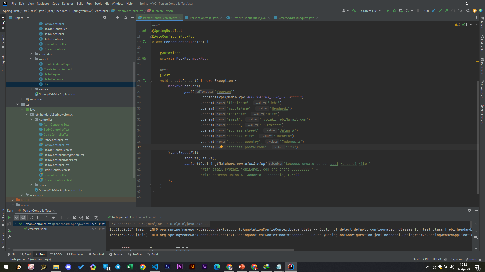

# Nested Model
- Salah satu yang powerfull di Model Attribute adalah, kita bisa otomatis juga membuat object dari nested attribute di Model
- Misal pada kasus Person sebelumnya, misal saja terdapat sebuah attribute Address yang merupakan Java Bean lainnya
- Untuk mengisi data Address, kita bisa gunakan . (titik), misal address.street, address.city, dan seterusnya

#
### Model CreateAddressRequest

#
### Model CreatePersonRequest

#
### Person Controller

#
### Unit Test Person Controller

