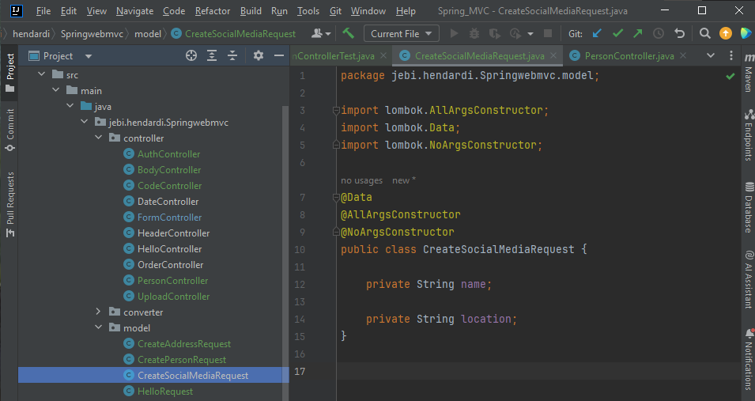
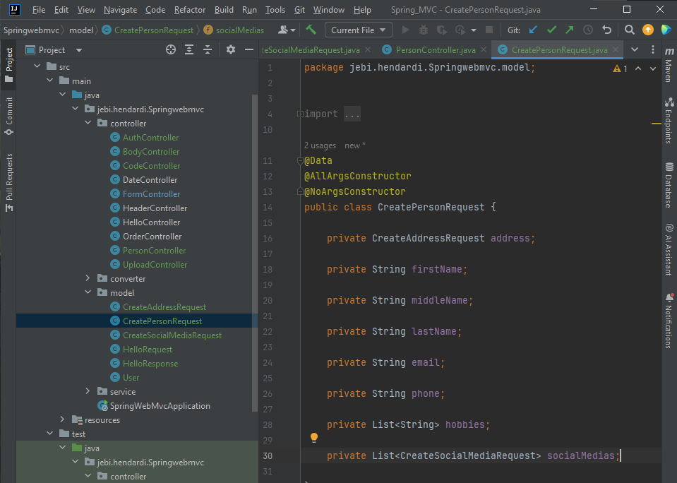
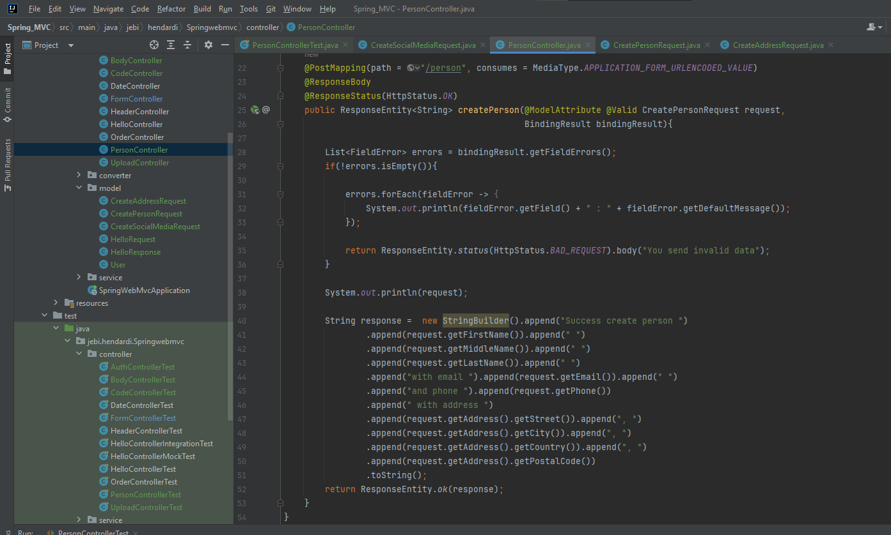
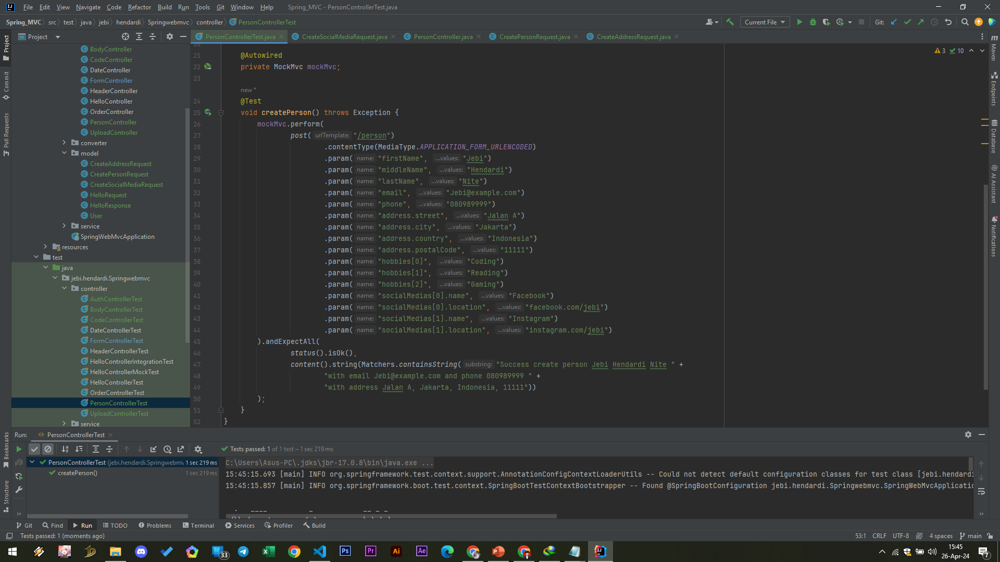

# List Model Attribute
- Selain nested attribute, kita juga bisa menggunakan List sebagai model attribute, cara mengirim parameter nya cukup mudah
- Untuk list dengan tipe data primitive seperti String, Integer, dan sejenisnya, kita bisa gunakan parameter : 
  - namaParam[0]=data1
  - namaParam[1]=data2
  - Dan seterusnya

- Untuk list dengan tipe data object lagi, kita bisa gunakan parameter :
  - namaParam[0].field1=data1
  - namaParam[0].field2=data2
  - namaParam[1].field1=data1
  - namaParam[1].field2=data2

#
### Model CreateSocialMediaRequest

#
### Model CreatePersonRequest

#
### PersonController

#
### Unit Test PersonController
