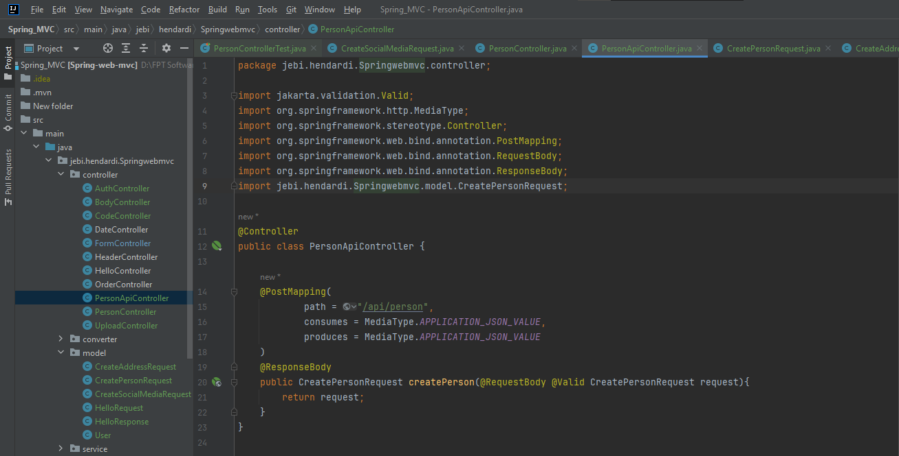
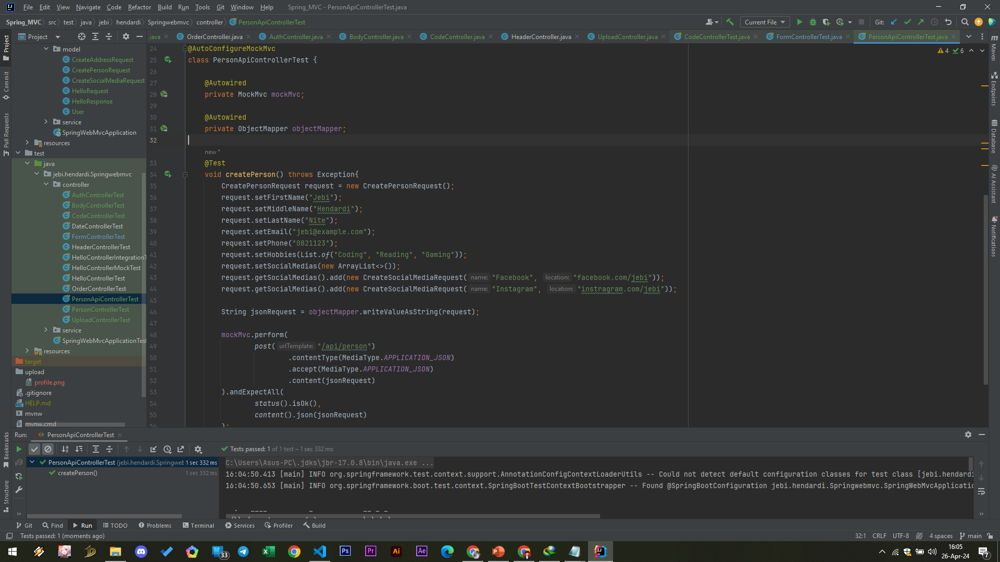

# Json
- Saat kita menggunakan consume dengan tipe data JSON atau produce dengan tipe data JSON, kita tidak perlu secara manual melakukan konversi dari object ke JSON String, hal itu sudah otomatis di handle oleh Jackson
- Kita tidak perlu membuat Bean Jackson secara manual lagi, karena itu sudah di handle oleh Spring Boot
- Jika kita butuh melakukan konfigurasi untuk Jackson, kita bisa menggunakan application properties
- Semua daftar konfigurasinya bisa kita gunakan dengan prefix spring.jackson.
- https://docs.spring.io/spring-boot/docs/current/reference/html/application-properties.html#appendix.application-properties.json 

#
### PersonApiController

#
### Unit Test PersonApiController

