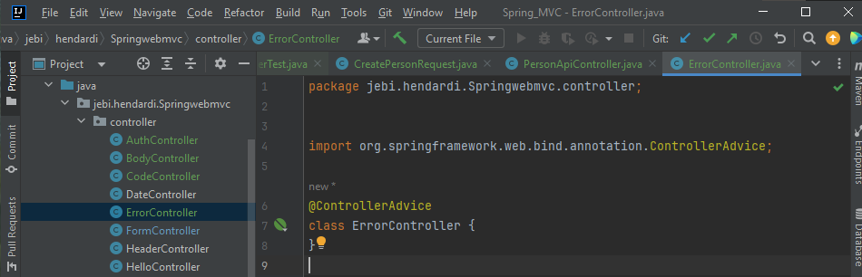
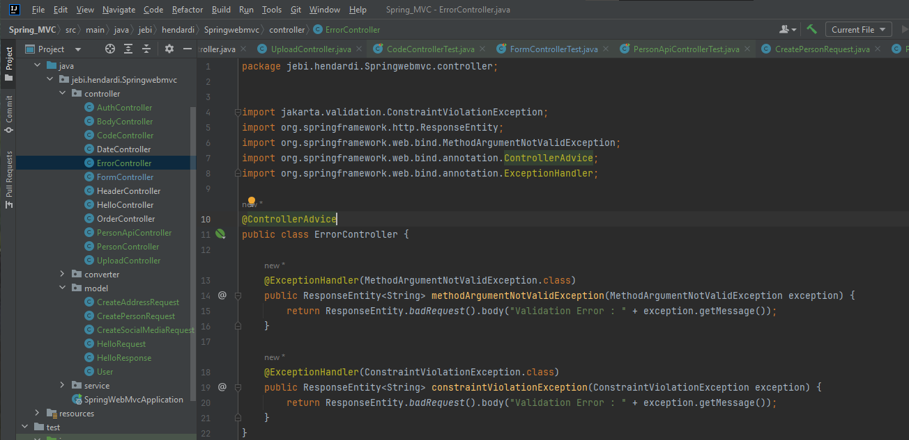
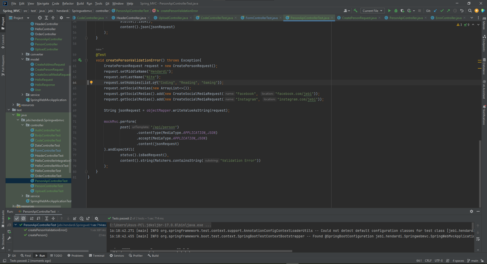

# Exception Handler

- Secara default, Spring akan mengembalikan response error sesuai jenis errornya
- Untuk membuat halaman atau response error sendiri Hal ini bisa kita buat dengan menggunakan @ControllerAdvice
- https://docs.spring.io/spring-framework/docs/current/javadoc-api/org/springframework/web/bind/annotation/ControllerAdvice.html 

### Controller Advice
- Controller Advice adalah sebuah class yang dipanggil ketika sebuah jenis exception terjadi
- Dengan begitu kita bisa memanipulasi response yang akan dikembalikan ke user menggunakan Controller Advice ini

#
### ErrorController

#
- Setelah membuat Controller Advice, untuk menangkap exception dan mengubah response nya, kita perlu membuat Method seperti di Controller
- Namun kita tidak menggunakan annotation @RequestMapping, melainkan @ExceptionHandler
- https://docs.spring.io/spring-framework/docs/current/javadoc-api/org/springframework/web/bind/annotation/ExceptionHandler.html 
- Kita harus tentukan jenis exception apa yang akan ditangkap, dan jika butuh data exception nya, kita bisa tambahkan sebagai parameter di Method nya

#
### Validation Exception Handler

#
### Unit Test PersonApiController

