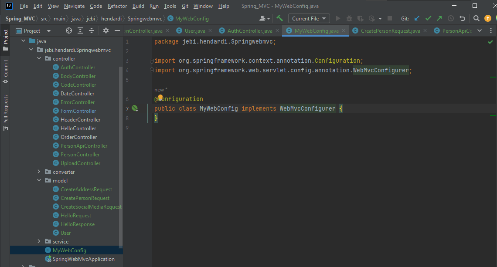

# MVC Config
- Saat membuat aplikasi web menggunakan Spring Web MVC, kita bisa menambahkan pengaturan untuk Spring Web MVC
- Caranya kita perlu membuat sebuah Bean configuration turunan dari WebMvcConfigurer
- https://docs.spring.io/spring-framework/docs/current/javadoc-api/org/springframework/web/servlet/config/annotation/WebMvcConfigurer.html

#
### MyWeb Config

