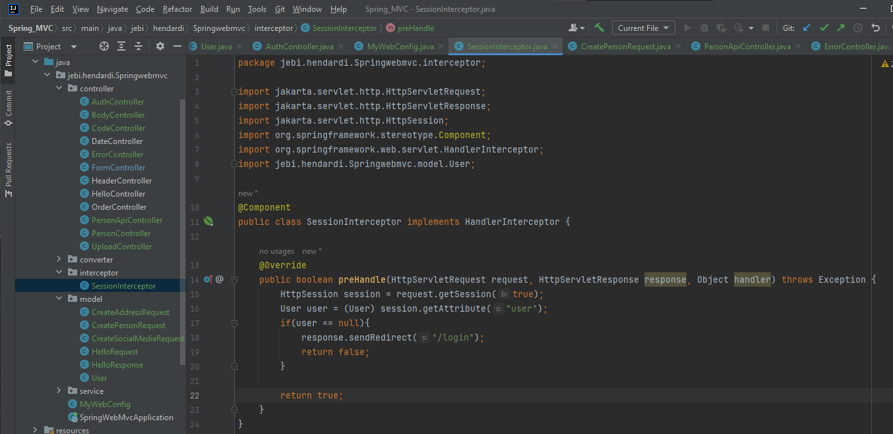
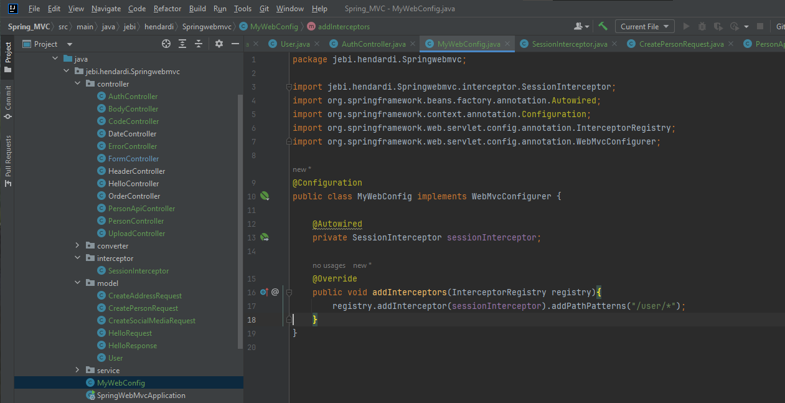
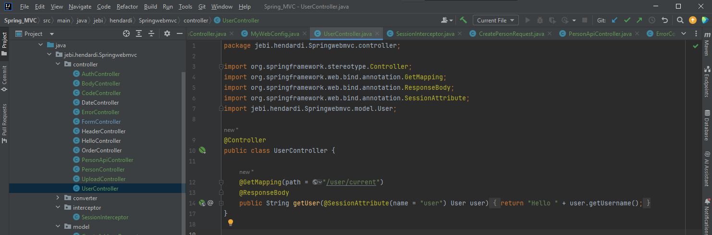
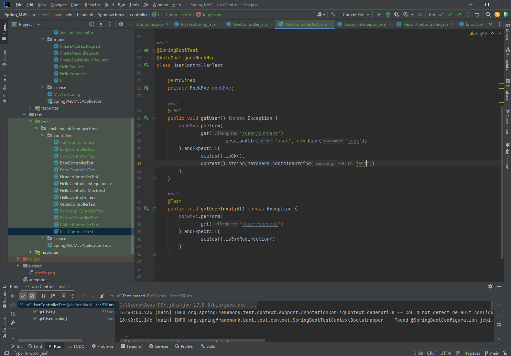

# Interceptor
- ada Java Servlet, kita tahu ada fitur yang bernama WebFilter, yang tugasnya mirip sebagai middleware
- Di Spring WebMVC, kita bisa menggunakan fitur bernama Interceptor, untuk melakukan hal yang sama
- Cara melakukan registrasi Interceptor adalah dengan membuat class turunan dari HandlerInterceptor, lalu menambahkan menggunakan InterceptorRegistry di method addInterceptors() WebMvcConfigurer
- https://docs.spring.io/spring-framework/docs/current/javadoc-api/org/springframework/web/servlet/HandlerInterceptor.html 

#
### Session Interceptor

#
### Registrasi Session Interceptor

#
### User Controller

#
### Unit Test User Controller
