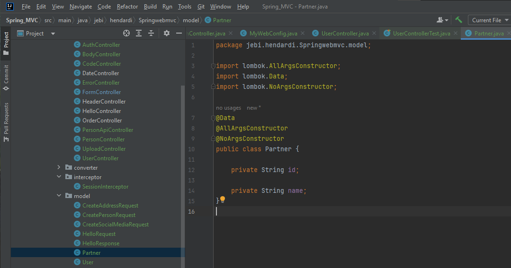
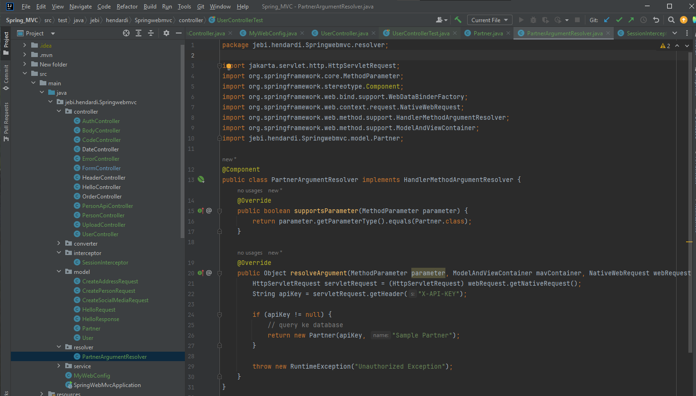
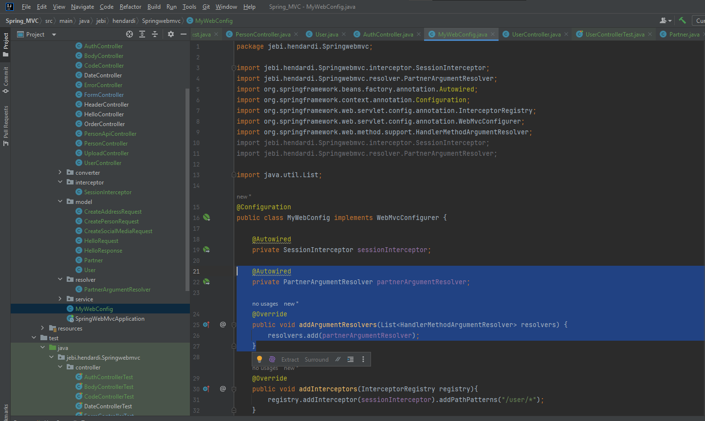
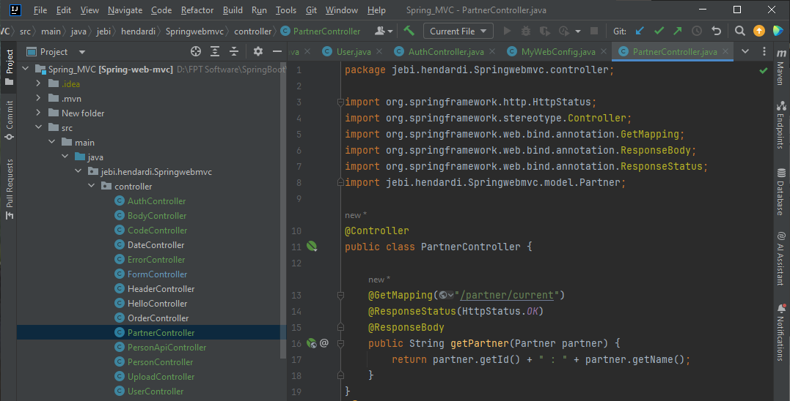
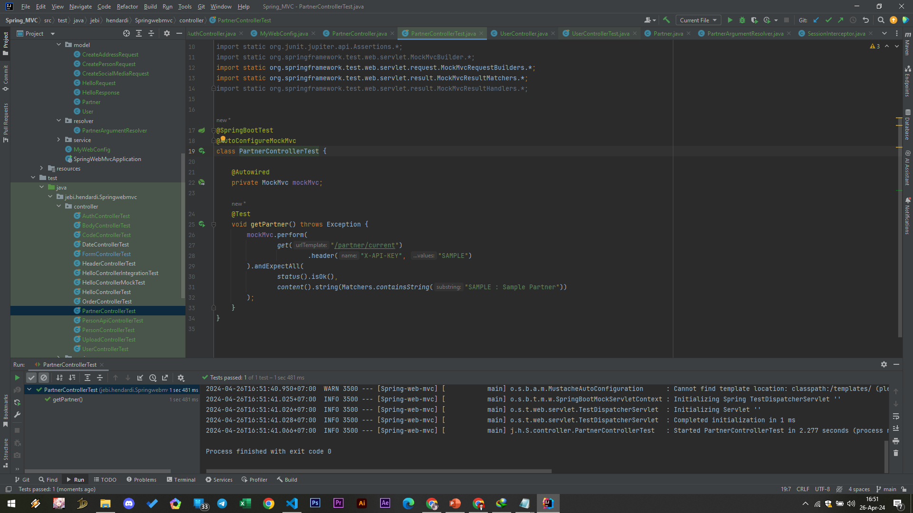

# Argument Resolver
- Saat kita menambahkan sebuah parameter di Controller Method, maka Spring Web MVC akan mencoba mencari dari mana data tersebut berasal
- Oleh karena itu kita perlu tambahkan penanda seperti ModelAttribute, RequestBody, RequestParam, dan lain-lain
- Kita juga bisa membuat sebuah ArgumentResolver, yaitu class yang digunakan untuk mengisi object argument yang kita inginkan secara otomatis
- Spring akan otomatis memanggil ArgumentResolver tersebut, ketika terdapat parameter dengan tipe data yang sudah kita tentukan

#
### Model Partner

#
### Partner Argument Resolver

#
### Web Mvc Configurer

#
### Partner Controller

#
### Unit Test Partner Controller
