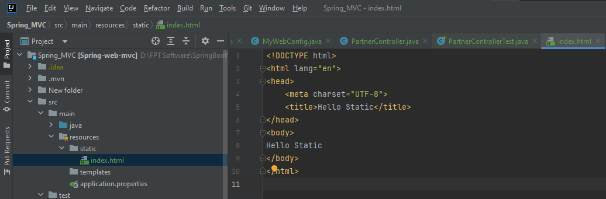
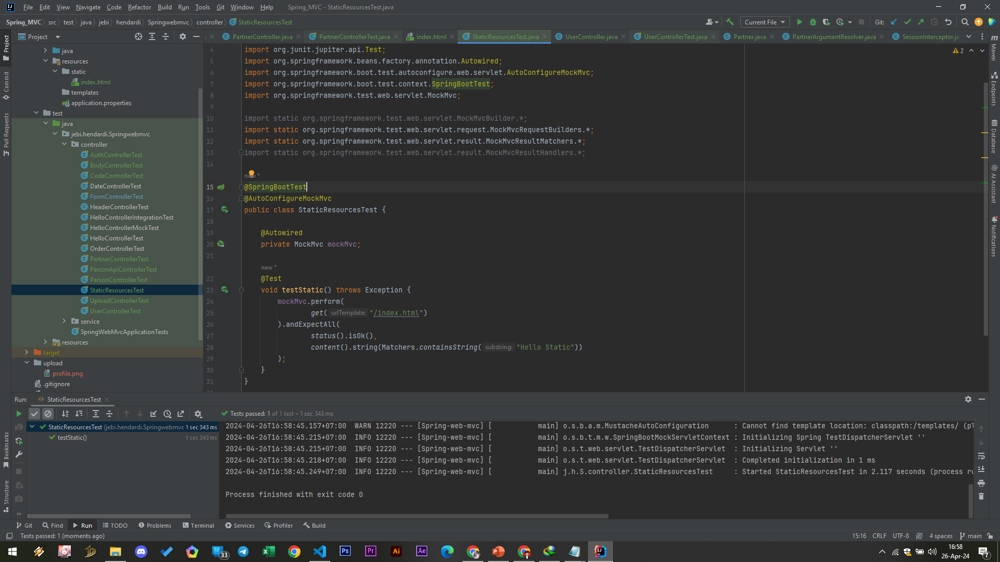

# Static Resources
- Saat kita membuat website, kita sering sekali membuat konten static, misal html, css, javascript, image, video, dan sejenisnya
- Jika kita handle semua dengan membuat Controller atau Servlet, maka akan menyulitkan
- Spring WebMVC memiliki fitur untuk menangani Static Resource ini, Kita bisa menambahkan semua resource static di folder static di directory resources
- Ketika kita mengakses Path di Spring Web MVC, pertama Spring akan mencoba mencari Controller yang memiliki Request Mapping tersebut, jika tidak ada, secara otomatis akan mencoba mengakses Static Resource, jika ternyata masih tidak ada, maka barus akan mengembalikan 404 Not Found

#
### Halaman Static Index (/resources/static/index.html)

#
### StaticResources Unit Test

