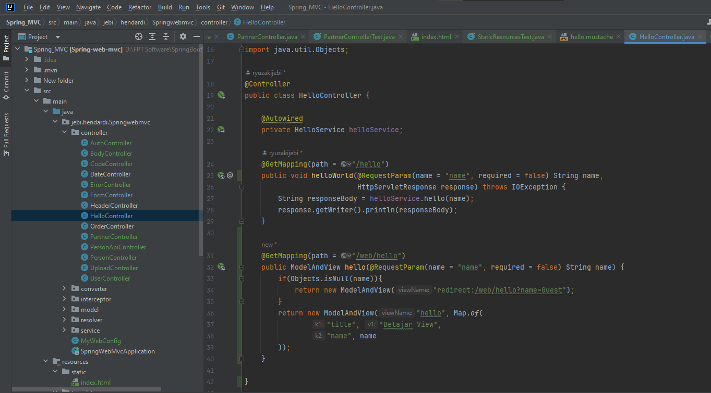

# Model and View
- Untuk menampilkan View, kita bisa mengembalika return object ModelAndView pada Controller Method
- Dalam ModelAndView, kita bisa memasukkan data template yang dipilih untuk View, dan juga Model yang akan ditampilkan di View
- https://docs.spring.io/spring-framework/docs/current/javadoc-api/org/springframework/web/servlet/ModelAndView.html 

#
### Hello Template

#
### HelloController

#
### Unit Test HelloController
