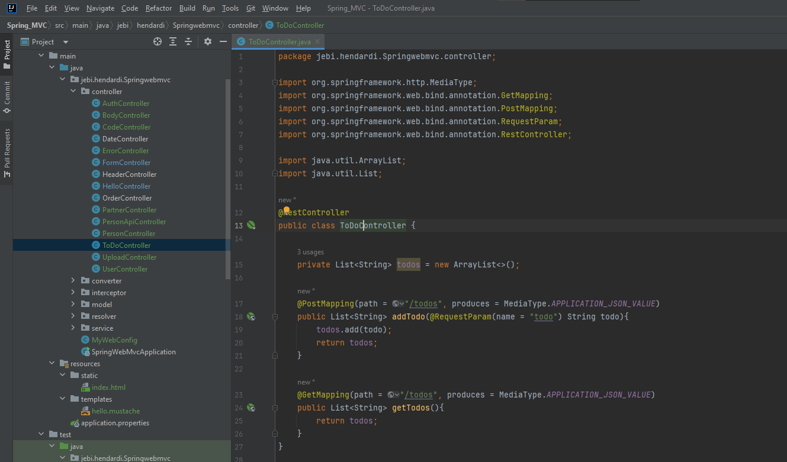
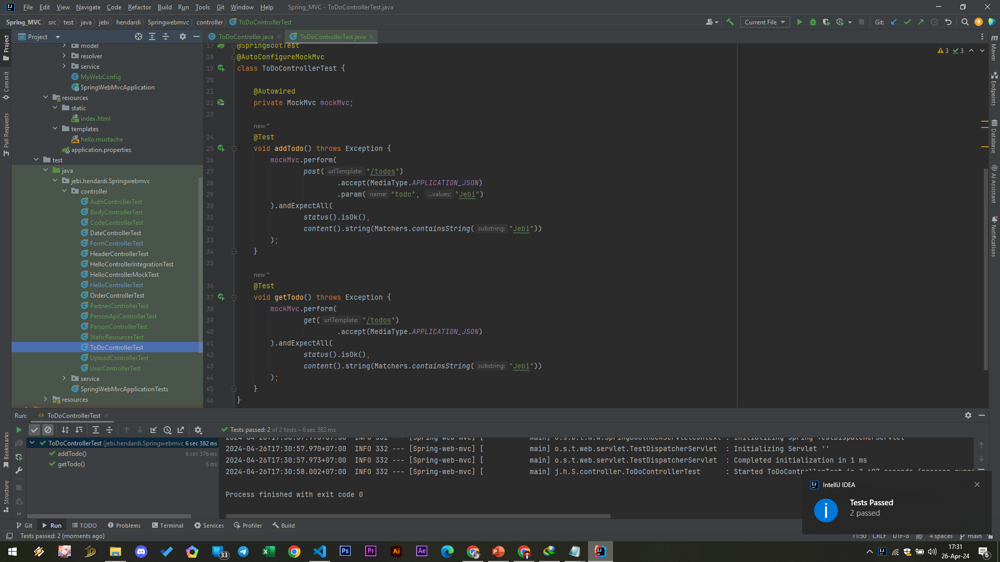

# RestController
- Spring Web MVC menyediakan annotation khusus untuk membuat Controller khusus untuk RESTful API, yaitu annotation RestController
- RestController ini sebenarnya gabungan antara @Controller dan @ResponseBody, yang artinya secara otomatis semua return Controller Method tersebut dianggap sebagai Response Body

#
### ToDoController

#
### Unit Test ToDoController
