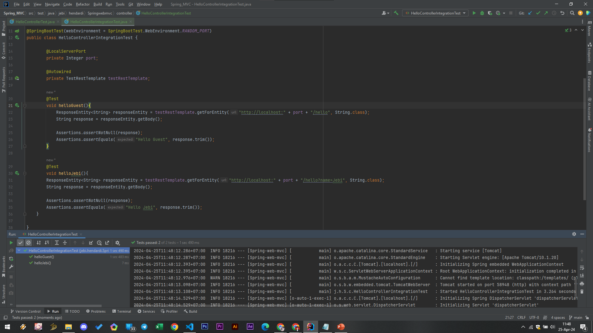

# Integration Test

- Saat kita menggunakan MockMVC, Spring tidak akan menjalankan aplikasi web kita
- Spring hanya menyediakan mock request da mock response
Test yang mensimulasikan saat aplikasi berjalan adalah menggunakan mode Integration Test
- Integration Test artinya adalah menjalankan aplikasi web secara lengkap, bersama dengan web server nya (Apache Tomcat)
- Secara otomatis kita bisa menjalankan aplikasi web ketika test berjalan, dan menghentikannya ketika test selesai
#
### TestRest Template

- Berbeda ketika kita menggunakan MockMVC, saat menggunakan mode Integration Test, karena tidak menggunakan mock lagi, maka untuk mengetest aplikasi, kita harus benar-benar mengirim request ke aplikasi web
- Spring memiliki HTTP Client bernama RestTemplate

```sh
@SpringBootTest(webEnvironment = SpringBootTest.WebEnvironment.RANDOM_PORT)
public class HelloControllerIntegrationTest {

        @LocalServerPort
        private Integer port;

        @Autowired
        private TestRestTemplate testRestTemplate;

        @Test
        void helloGuest(){
            ResponseEntity<String> responseEntity = testRestTemplate.getForEntity("http://localhost:" + port + "/hello", String.class);
            String response = responseEntity.getBody();

            Assertions.assertNotNull(response);
            Assertions.assertEquals("Hello Guest", response.trim());
        }

        @Test 
        void helloJebi(){
        ResponseEntity<String> responseEntity = testRestTemplate.getForEntity("http://localhost:" + port + "/hello?name=Jebi", String.class);
        String response = responseEntity.getBody();

        Assertions.assertNotNull(response);
        Assertions.assertEquals("Hello Jebi", response.trim());
    }
        
}
```
#
### Hasil Integration Test

