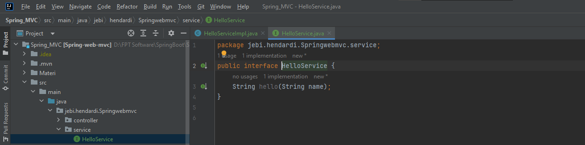

### Service Layer
- Service Layer di Spring memiliki annotation khusus, yaitu @Service
- Saat kita menambahkan @Service, secara otomatis juga class tersebut akan di registrasikan sebagai bean

#
### Interface 
- Saat kita membuat Service Layer, kita akan buat dalam bentuk Interface
- Lalu kita akan buat class implementasi yang diregistrasikan sebagai Spring Bean
- Sedangkan class yang membutuhkan Service Layer tersebut, akan menggunakan Interface nya, bukan class implementasinya
- Salah satu keuntungan mengekspos Interface dibanding Class adalah, kita bisa mengubah atau mengganti isi dari class implementasi, tanpa berdampak pada class lain yang menggunakan interface nya.

#
### Interface HelloService 


#
### Class HelloServiceImpl


#
### Unit Test Service 
```sh
@SpringBootTest
class HelloServiceImplTest {

    @Autowired
    private HelloService helloService;

    @Test
    void hello(){
        assertEquals("Hello Guest", helloService.hello(null));
        assertEquals("Hello Jebi", helloService.hello("Jebi"));
    }
}
```

