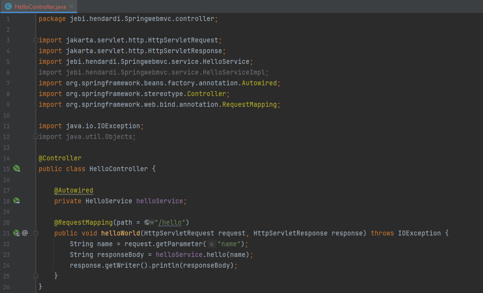
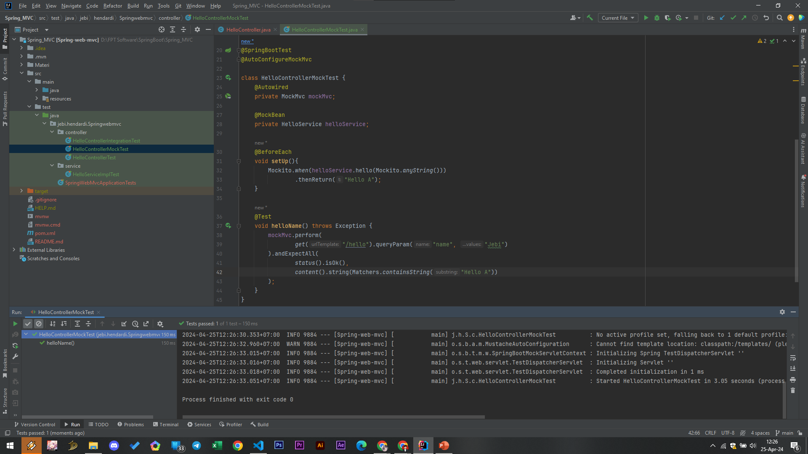

# Mock Bean
- Spring secara otomatis meregistrasikan Mock object tersebut sebagai bean, sehingga class yang membutuhkan bean tersebut, secara otomatis bisa mendapatkan Mock object yang kita buat.
- Untuk membuat Mock Bean, kita cukup gunakan annotation @MockBean

#
### Update Hello Controller

#
### Hello Controller Mock Test

