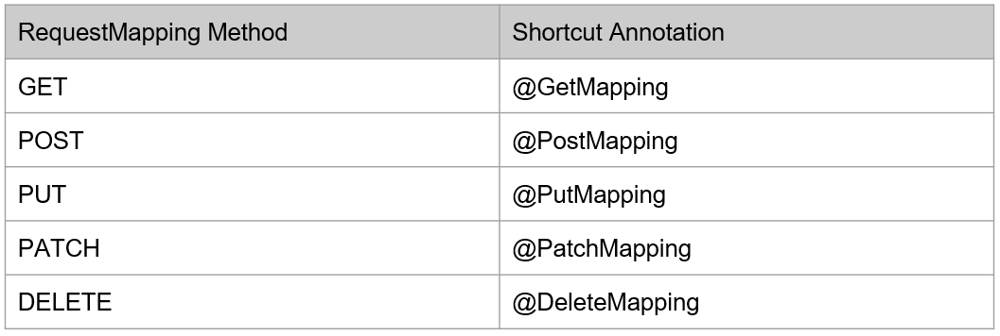

# Request Method

- Saat kita menggunakan RequestMapping, terdapat attribute method yang bisa kita gunakan untuk menentukan jenis HTTP Method yang diperbolehkan
- Secara default, jika kita tidak memilihnya, maka Controller Method tersebut bisa diakses oleh seluruh jenis HTTP Method
- Jika kita mengirim method yang tidak diperbolehkan, maka Spring akan menolak dengan response 405 Method Not Allowed

#
### Shortcut Annotation


#
### Contoh Update HelloController GetMapping
```sh
@Controller
public class HelloController {

    @Autowired
    private HelloService helloService;

    @GetMapping(path = "/hello")
    public void helloWorld(HttpServletRequest request, HttpServletResponse response) throws IOException {
        String name = request.getParameter("name");
        String responseBody = helloService.hello(name);
        response.getWriter().println(responseBody);
    }
}
```