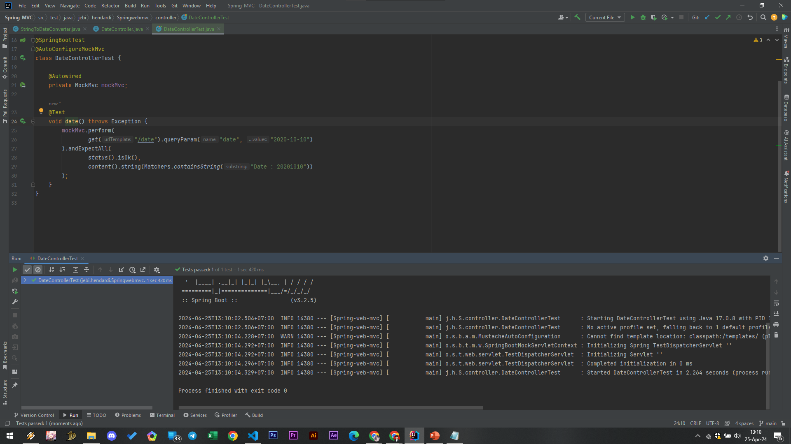

# Request Param
- Kita bisa menggunakan Annotation @RequestParam untuk memberitahu bahwa kita membutuhkan request parameter
- Kita bisa menambahkan apakah query parameter itu wajib atau tidak, dan juga bisa menambahkan default value nya jika tidak dikirim oleh user.
- Secara otomatis data request parameter akan dikirim datanya ke parameter yang kita tentukan.

#
### HelloController RequestParam
```sh
@Controller
public class HelloController {

    @Autowired
    private HelloService helloService;

    @GetMapping(path = "/hello")
    public void helloWorld(@RequestParam(name="name", required = false) String name, HttpServletResponse response) throws IOException {
        String responseBody = helloService.hello(name);
        response.getWriter().println(responseBody);
    }
}
```

#
### HelloController Test


#
### Konversi Tipe Data
- Query parameter datanya adalah String
- Namun jika kita membutuhkan datanya dalam bentuk tipe data lain, Spring bisa secara otomatis melakukan konversi tipe datanya menggunakan fitur Converter.

### Date Converter
```sh
@Controller
public class DateController {

    private final SimpleDateFormat dateFormat = new SimpleDateFormat("yyyyMMdd");

    @GetMapping(path = "/date")
    @ResponseBody
    public void getDate(@RequestParam(name = "date") Date date,
            HttpServletResponse response) throws IOException {
        response.getWriter().println("Date : " + dateFormat.format(date));
    }
}
```

#
### Hasil Test


