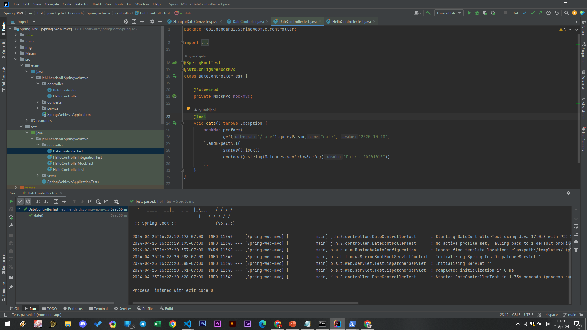

# Response Body
- Secara default, kita harus menuliskan response dari Controller Method ke HttpServletResponse
- Namun hal ini kadang menyulitkan jika misal kita hanya ingin mengembalikan data berupa String
- Spring memiliki annotation @ResponseBody, yang bisa secara otomatis menjadikan data yang dikembalikan dari Controller Method menjadi data yang ditulis ke HttpServletResponse

```sh
@Controller
public class DateController {

    private final SimpleDateFormat dateFormat = new SimpleDateFormat("yyyyMMdd");

    @GetMapping(path = "/date")
    @ResponseBody
    public String getDate(@RequestParam(name = "date") Date date) throws IOException {
        return "Date : " + dateFormat.format(date);
    }
}
```

#
### Unit Test DateControllerTest


